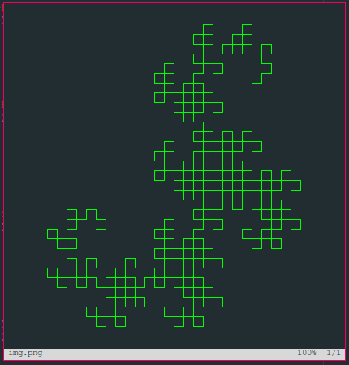
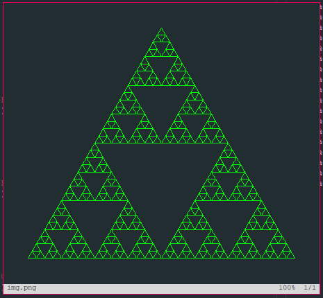
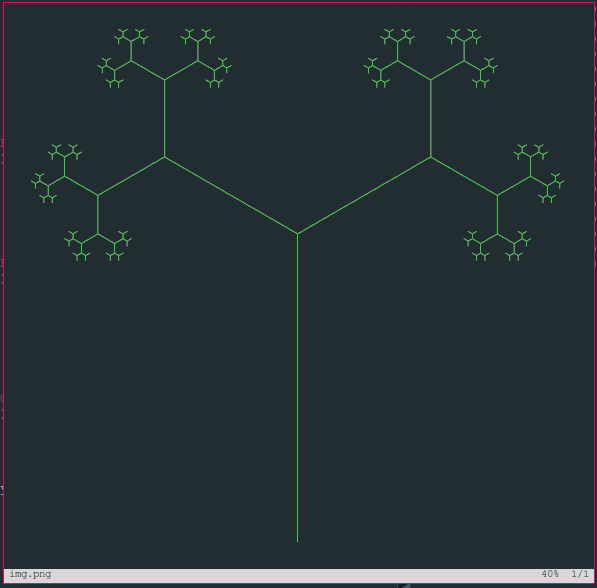

# l-systems
Program to render fractal image from formal language

## Usage 

```racket
(define rules
  (hash 'word "F"                      ; starting word
        'productions '((#\F "FF") ...) ; list of productions -- (#\F "FF") denotes the production F -> FF
        'turn (/ pi 2)                 ; turn angle in radians -- applies to 'F' and 'G'
        'turn-backtrack 0              ; turn angle in radians before and after backtracking
        'rotation 0))                  ; initial direction
  
(render rules depth)
```

## Supported symbols:
- `F`: draw forward
- `G`: draw forward
- `+`: turn counter clockwise by `'turn` radians
- `-`: turn clockwise by `'turn` radians
- `[`: push current state and turn counter clockwise by `'backtrack-turn` radians
- `]`: pop current state and turn clockwise by `'backtrack-turn` radians


# Examples

## Fern
```racket
(define fern
  (hash 'word "G"
        'turn (* pi 5/36)
        'backtrack-turn 0
        'rotation (* (- pi) 1/3)
        'productions '((#\G "F+[[G]-G]-F[-FG]+G")
                       (#\F "FF"))))

(render fern 5)
```


## Dragon fractal
```racket
(define dragon
  (hash 'word "F"
        'turn (/ pi 2)
        'backtrack-turn 0
        'rotation 0
        'productions '((#\F "F+G") 
                      (#\G "F-G"))))

(render dragon 8)
```


## Sierpinski triangle
```racket
(define sierpinski
  (hash 'word "F-G-G"
        'turn (* pi 2/3)
        'backtrack-turn 0
        'rotation pi
        'productions '((#\F "F-G+F+G-F")
                       (#\G "GG"))))

(render sierpinski 5)
```


## Binary tree
```racket
(define binary-tree
  (hash 'word "F"
        'turn 0
        'backtrack-turn (/ pi 3)
        'rotation (/ (- pi) 2)
        'productions '((#\F "G[F]F")
                       (#\G "GG"))))

(render binary-tree 6)
```



