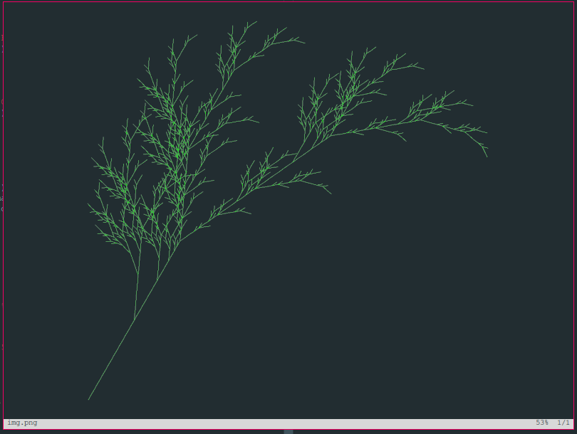

# l-systems
Program to render fractal image from formal language

## Demo 1

```racket
(define fern
  (hash 'word "G"
        'turn (* pi 5/36)
        'backtrack-turn 0
        'rotation (* (- pi) 1/3)
        'productions '((#\G "F+[[G]-G]-F[-FG]+G")
                       (#\F "FF"))))

(render fern 5)
```

